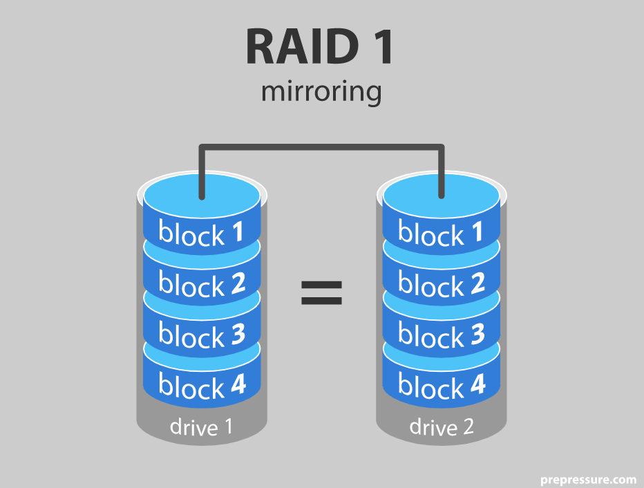

```{r setup, echo = FALSE}
#Set general chunk options
knitr::opts_chunk$set(message = FALSE, warning = FALSE, echo = FALSE)
#Check if packages are installed and install them if needed
if(!require("readxl", quietly = TRUE)) install.packages("readxl")
if(!require("dplyr", quietly = TRUE)) install.packages("dplyr")
if(!require("stringr", quietly = TRUE)) install.packages("stringr")
if(!require("ggplot", quietly = TRUE)) install.packages("ggplot")
if(!require("here", quietly = TRUE)) install.packages("here")
```

Data management while doing data sciences has proven to be challenging at times as it is vastly dynamic. The Guerilla Analytics as described by Enda Ridge (ISBN: 9780128002186) provide a framework built on seven core principles which I have implemented in this portfolio.

##Space is cheap, confusion is expensive

 ##Change to html or R code?
